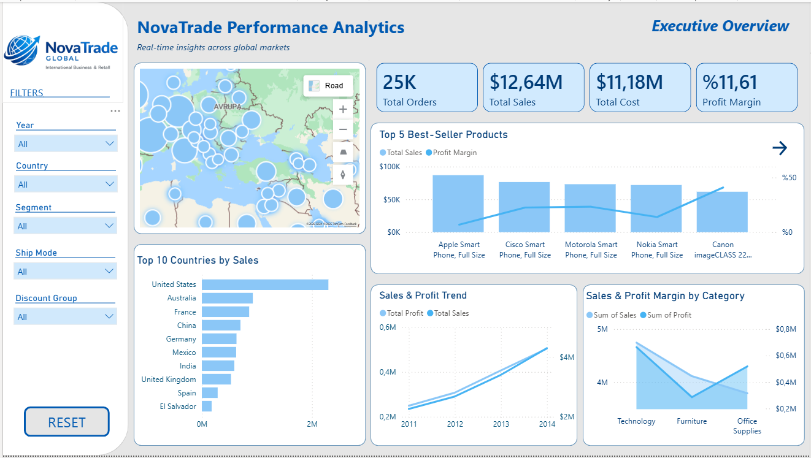
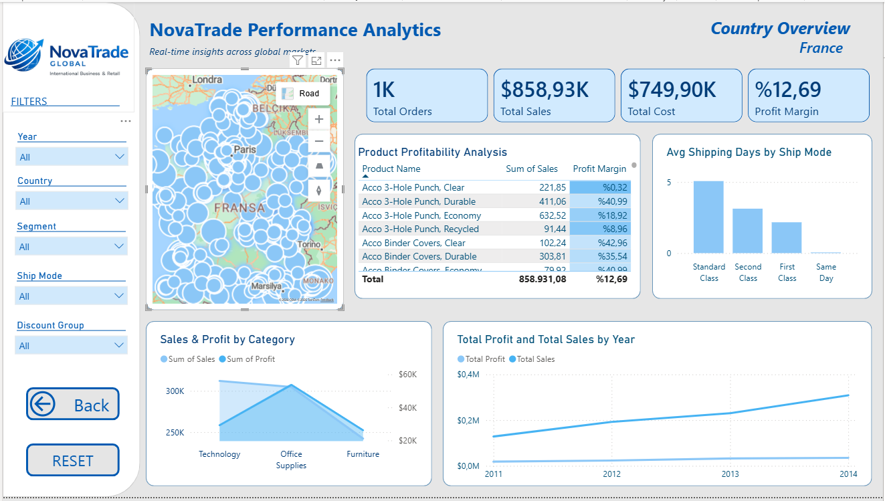
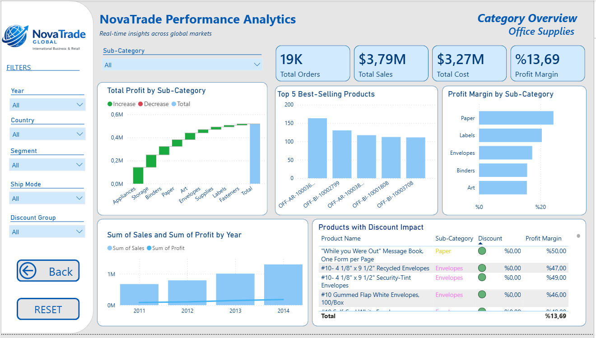

# Global Superstore Sales Analysis Dashboard

## Project Overview
This project presents an end-to-end data analytics workflow using the Global Superstore dataset.

The main objective was to analyze sales performance, profitability, discount strategies, and shipping efficiency across different countries, categories, and products.

This project includes:
- Data cleaning with SQL Server
- Exploratory Data Analysis (EDA) with Python
- Interactive dashboard development with Power BI

---

## Business Problem
The goal of this project was to analyze global sales performance and identify the main factors affecting profitability.

The analysis focused on understanding:
- Which countries generate the highest revenue
- Which categories and products are most profitable
- How discount strategies impact profitability
- How shipping costs affect business performance

---

## Tech Stack
- Power BI
- SQL Server
- Python
- DAX
- Power Query

---

## Data Preparation
Data cleaning and transformation steps were performed in SQL Server.

Main operations:
- Data type conversions
- Date formatting
- Column cleaning
- Missing value checks
- Feature engineering

Additional calculated field:
- Estimated Cost = Sales - Profit

---

## Exploratory Data Analysis (Python)
EDA was conducted to understand dataset patterns and relationships.

Analysis included:
- Distribution analysis
- Country-level performance
- Category profitability
- Shipping cost analysis
- Discount-profit relationship

---

## Dashboard Pages

### Executive Overview

- Overall sales performance
- Total orders, sales, cost, and profit margin
- Top-performing countries and products

---

### Country Overview

- Country-specific performance analysis
- Sales and profit trends
- Product profitability
- Shipping performance

---

### Category Overview

- Category and sub-category level analysis
- Best-selling products
- Profit contribution by sub-category

---

### Global Discount Analysis (Year-Based)

- Year-based global discount performance
- Discount group distribution
- Discount impact on profitability over time
- Global discount-profit relationship

---

### Country-Based Discount Analysis

- Country-specific discount performance
- Discount impact on profit margin
- Loss-making discount behavior by country

---

### Country-Based Discount Analysis

- Country-level discount behavior
- Discount-profit relationship by year

---

## Key Insights
- High discount rates consistently reduced profit margins.
- Orders with discounts above 50% frequently resulted in losses.
- Some countries generated strong sales but relatively weak profitability.
- Shipping costs had a noticeable impact on overall profit margins.
- Product profitability varied significantly across categories and regions.

---

## Recommendations
- Optimize discount strategies.
- Focus on high-margin products.
- Improve logistics efficiency.
- Monitor low-profit regions more closely.

---

## Dataset
The raw dataset is not included in this repository.

This project was developed using the Global Superstore dataset for educational and portfolio purposes.

## Dataset
Dataset Source: [Global Superstore Dataset](https://www.kaggle.com/datasets/apoorvaappz/global-super-store-dataset) 
